## Level 3

There are two file we can use to solve this level.

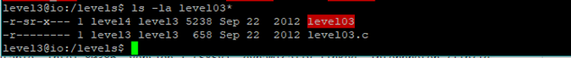

Let’s see what file this actually is.

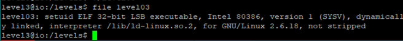

Now let’s look at the source code of the file.

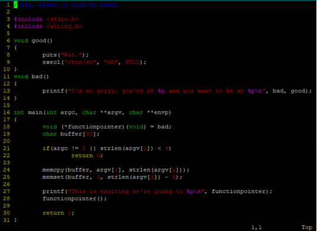

This program introduces the concept of buffer overflow to overwrite nearby local variable (more specifically, variables below the buffer).

### Inside a Stack Frame

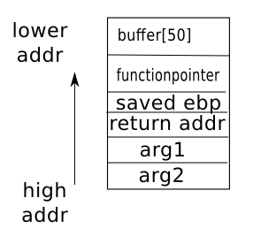

The variable functionpointer is store below the variable buffer.

In this case, `functionpointer` contains the address of function `bad`. `functionpointer()` would eventually call `bad()`. However, we can overwrite the value of `functionpointer` to address of function `good`.

### memcpy

After looking at the man page for `memcpy` and how it is used here. We see that `memcpy` did not restrict length of `argv[1]` to be copied to buffer. Hence, by copying more than what the `buffer[50]` can hold, we start to overwrite the memory below it. This is known as buffer overflow.

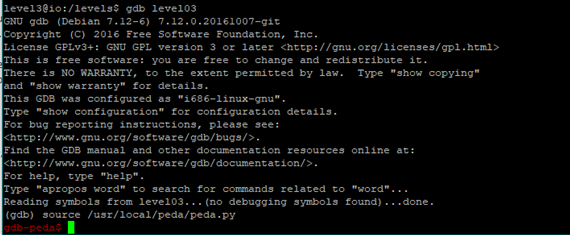

`gdb peda` is a GDB plugin that helps greatly in visualization of registers, instructions and stack content. This is a great tool for dynamic analysis. 

### Knowing what variable is where

When you `disass main`, it can be very scary to see a long list of assembly code.

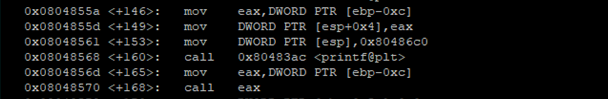

From the source code, we know that printf will have a string as argument1 and `functionpointer` as argument2.
The calling convention of x86 for function is to have argument on the top of stack. Then argument 2 below argument 1.

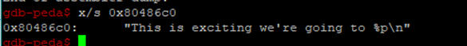

With gdb examine, we can confirm that argument1 really contain the string.
So functionpointer is located at `esp+0x4`. However, I would recommend you to find a reference that uses `ebp` instead of `esp`. This is because the value of ebp is constant in a stack frame whereas `esp` can vary.

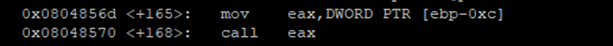

This is another place that reference our `functionpointe`. Notice call `eax` from this, we know `functionpointer` is at `ebp-0xc`.
We can do the same to find out where is buffer.

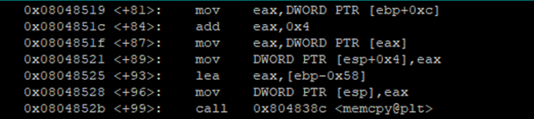

From the above snippet, buffer is at `ebp-0x58`
Now, we just need to find the distance between `buffer` and `functionpointer`

```python
>>> 0x58-0xc
76
```

From above, we see it actually takes 76 bytes to reach the local variable `functionpointe`r instead of 50 bytes.

### testing out

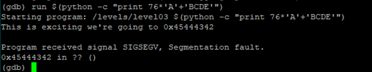

Here, we used `$()` to evaluate a bash command before passing as argument 1. `python -c` allows us to run a string as command.
`0x42` is the letter 'B'. We can see that the program says "we're going to 0x45444342". The program crashes because `0x45444342` is an illegal address.
We have crashed the program at `0x45444342` which correspond to "EDCB" instead of "BCDE". The order of the bytes is read from right to left instead of left to right (big endian). It is important to note the endianness when overwrite values in memory.

### Finding address of good.

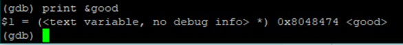

### Exploit

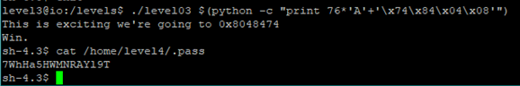


