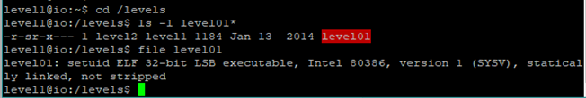
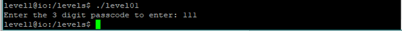

### First Look

When you login to the level 1, there you can find a README file by typing “ls” command. You will find introduction to how to play the game.

Inside the levels directory you will find level01 file. From this simple file command, we can see that it is Executable Linkable Format. 32 bits architecture and written for the intel CPU.

