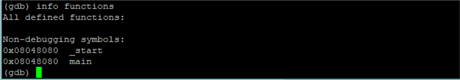
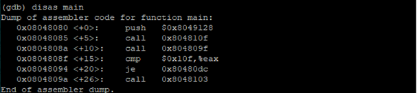
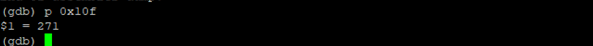
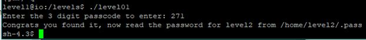
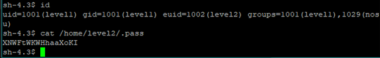

### First Look

When you login to the level 1, there you can find a README file by typing `ls` command. You will find introduction to how to play the game.

Inside the levels directory you will find level01 file. From this simple file command, we can see that it is Executable Linkable Format. 32 bits architecture and written for the intel CPU.

When we run the program, it will ask for a 3-digit passcode.
Here we use GNU debugger `gdb` to do reverse engineering this program to go to the level 2.

After launching the program under `gdb`, we look for the function in this program using `info functions` command.

Show the disassembly code for the main function (entry point of the program).
When we study the assembly, we can identify that the program compares a fixed value with the value of the register `eax`.
This value is a hexadecimal value, we can display its decimal value with p in `gdb`.

Apparently, we are comparing the entered value, which is stored in the `eax` register. So we can assume the password is 271.

The password for level2 is `XNWFtWKWHhaaXoKI`.

