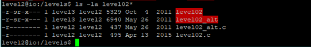
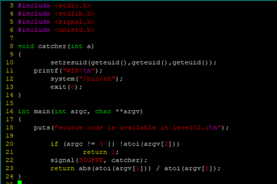
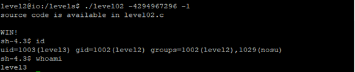
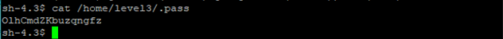

### Level 2

There are two different binaries and source code for both.

We try to solve this problem using `level02.c`

From above, we see that our goal is to call `catcher`. `argc` is argument count of a program. It includes the program name itself as `argv[0]`. Hence, the above program requires. `/level02 arg1 arg2` in order to not return 1. `Arg2` cannot be zero too hence, this guards against Division by Zero Error.

From the man page, we can see that a program can deliver signals in the form of signum to the process. This is very familiar to how one usually aborts a program via `^C`. In fact, `^C` actually sends a `SIGINT` to the process.
Back to the code, we see that we have to somehow trigger a `SIGFPE`, floating point error. If you look closely in the man page, you will see a way to do so!
So, we are going to division of most negative integer by -1.

Here is the password for level 3

